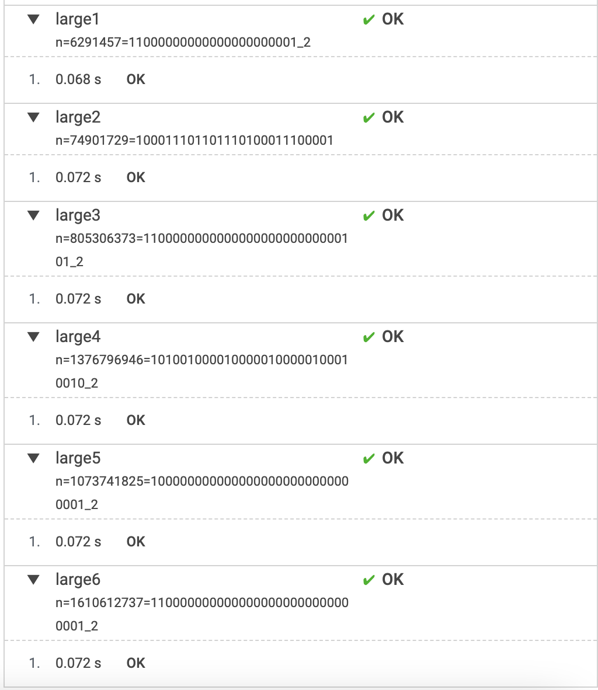

# Codility - Lesson 1 BinaryGab


## 문제

* <https://app.codility.com/programmers/lessons/1-iterations/binary_gap/>

## 문제 요약

* 숫자 N을 이진수로 변환시 1 과 1 사이의 0의 갯수가 가장 큰 경우의 길이를 구해야 한다.
* 문제에서 주어지는 테스트 케이스는 다음과 같다.
  * N이 9 이면 2 반환
  * N이 529 이면 4 반환
  * N이 20이면 1 반환
  * N이 15이면 0 반환
  * N이 32이면 0 반환
  * N이 1041이면 5 반환

## 풀이

### 코드1

* 문제에서 주어진 테스트 케이스를 확인 하면서 가장 먼저 떠오르는 대로 코드를 작성 했다.

> 숫자 N을 이진수 배열로 변환한 후 반복문을 돌린다. 1이면 count 와 result 중 더 큰 수를 result 에 담고 count 는 0으로 초기화 한다. 0이면 count를 1씩 증가 시킨다. 반복문이 끝나고 result 를 반환 한다.

```js
function solution (N) {
    const binary = N.toString(2).split('');
    let count = 0;
    let result = 0;
    binary.forEach(n => {
        if (n === '1') {
            result = Math.max(count, result);
            count = 0;
        } else {
            count += 1;
        }
    })
    return result;
}
```

### 코드2

* 조금 생각 후 다시 시도 해보았다.

> 숫자 N을 이진수로 변환 후 구분자 '1'로 문자열을 나누고 배열의 마지막 값은 버린다. 남은 배열에서 문자열의 길이가 가장 큰 값을 구해서 반환 한다.

```js
function solution(N) {
    const binary = N.toString(2).split('1');
    binary.pop();
    return Math.max.apply(null, binary.map(str => str.length));
}
```

## 풀이 결과

* 코드1, 코드2 모두 Codility 평가에는 성능 차이 없이 Score 100으로 통과 되었다.
* 기대와 달리 Codility 평가에서 차이가 없었지만, 코드2가 보기에 깔끔해서 더 좋다고 생각한다.




## 기억하기

* 진수 변환은 10진수를 변환 할 때는 Number 의 내장 함수인 `toString()` 을 사용하고 반대에는 전역함수인 `parseInt()` 함수를 사용 할 수 있다.
* String 의 `length` 속성은 UTF-16 코드를 기준으로 문자열의 길이를 나타낸다.
* `split` 은 string 객체를 지정한 문자열로 구분하여 여러개의 문자열로 나누는 것이다. 코드 1에서 `if (n === 1)`과 같은 실수는 조심 하자.
* `split` 함수의 구분자로 "" 을 제공하면 UTF-16 코드로 나누게 되어 글자가 깨질 수 있으니, 다음과 같은 방법들을 사용하자.

```js
// DO NOT USE THIS!
const binary = N.toString(2).split('');

// Spread syntax
const binary = [...N.toString(2)];

// Array.from
const binary = Array.from(N.toString(2));

// RegExp u flag
const binary = N.toString(2).split(/(?=[\s\S])/u);

```

## 참조링크

* [MDN 문서 - Number의 내장 함수 toString](https://developer.mozilla.org/ko/docs/Web/JavaScript/Reference/Global_Objects/Number/toString)
* [MDN 문서 - String의 내장 함수 split](https://developer.mozilla.org/ko/docs/Web/JavaScript/Reference/Global_Objects/String/split)
* [MDN 문서 - 전역함수 parseInt](https://developer.mozilla.org/ko/docs/Web/JavaScript/Reference/Global_Objects/parseInt)
* [스택 오버 플로우 How to get character array from a string?](https://stackoverflow.com/questions/4547609/how-to-get-character-array-from-a-string/34717402#34717402)
