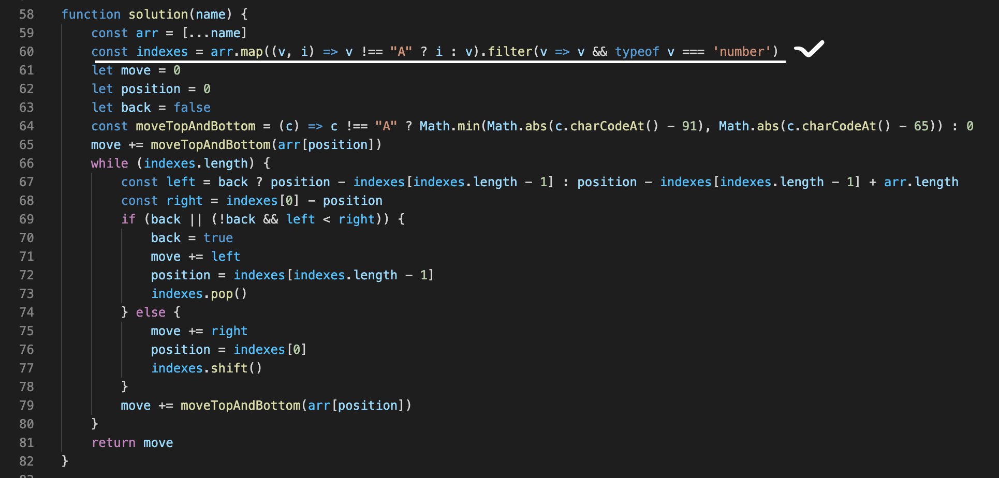

# 프로그래머스 - Greedy 2 조이스틱 / javascript



* [풀어보기](https://programmers.co.kr/learn/courses/30/lessons/42860)

## 문제

조이스틱으로 알파벳 이름을 완성하세요. 맨 처음엔 A로만 이루어져 있습니다.
ex) 완성해야 하는 이름이 세 글자면 AAA, 네 글자면 AAAA

조이스틱을 각 방향으로 움직이면 아래와 같습니다.

> ▲ - 다음 알파벳  
> ▼ - 이전 알파벳 (A에서 아래쪽으로 이동하면 Z로)  
> ◀ - 커서를 왼쪽으로 이동 (첫 번째 위치에서 왼쪽으로 이동하면 마지막 문자에 커서)  
> ▶ - 커서를 오른쪽으로 이동  

예를 들어 아래의 방법으로 "JAZ"를 만들 수 있습니다.  
>
> * 첫 번째 위치에서 조이스틱을 위로 9번 조작하여 J를 완성합니다.  
> * 조이스틱을 왼쪽으로 1번 조작하여 커서를 마지막 문자 위치로 이동시킵니다.  
> * 마지막 위치에서 조이스틱을 아래로 1번 조작하여 Z를 완성합니다.  
> 따라서 11번 이동시켜 "JAZ"를 만들 수 있고, 이때가 최소 이동입니다.  

만들고자 하는 이름 name이 매개변수로 주어질 때, 이름에 대해 조이스틱 조작 횟수의 최솟값을 return 하도록 solution 함수를 만드세요.

## 제한사항

* name은 알파벳 대문자로만 이루어져 있습니다.
* name의 길이는 1 이상 20 이하입니다.

## 풀이

* 상하 이동거리는 A-Z 중 절반이 넘으면 아래로 이동하고 넘지 않으면 위로 이동한다.
* 좌우 이동거리는 현재 위치에서 좌측 혹은 우측 방향으로 이동시 A가 아닌 알파벳까지 몇 칸이동하는지를 구해서 비교한다음 더 짧은 거리를 선택한다.

> 좌우 이동거리를 구하기 위해 A가 아닌 알파벳의 위치를 미리 배열에 기억해서 시간복잡도를 O(n)으로 할 수 있었다.

### 코드1

* 제출한 답안

```js
function solution(name) {

    let arr = [...name]
    let move = 0
    let position = 0
    let back = false

    if (arr[0] !== "A") {
        move += Math.min(Math.abs(arr[0].charCodeAt() - 91), Math.abs(arr[0].charCodeAt() - 65))
    }

    const indexes = arr.map((v, i) => v !== "A" ? i : v).filter(v => v && typeof v === 'number')
    while (indexes.length) {

        if (!back) {
            const left = position + arr.length - indexes[indexes.length - 1]
            const right = indexes[0] - position

            if (left < right) {
                back = true
                move += left
                position = indexes[indexes.length - 1]
                indexes.pop()
            } else {
                move += right
                position = indexes[0]
                indexes.shift()
            }

        } else {
            const left = position - indexes[indexes.length - 1]
            move += left
            position = indexes[indexes.length - 1]
            indexes.pop()

        }
    
        if (arr[position] !== "A") {
            move += Math.min(Math.abs(arr[position].charCodeAt() - 91), Math.abs(arr[position].charCodeAt() - 65))
        }
    
    }
    return move
}
```

### 코드2

* 제출한 답안을 간소화

```js
function solution(name) {
    const arr = [...name]
    const indexes = arr.map((v, i) => v !== "A" ? i : v).filter(v => v && typeof v === 'number')
    let move = 0
    let position = 0
    let back = false
    const moveTopAndBottom = (c) => c !== "A" ? Math.min(Math.abs(c.charCodeAt() - 91), Math.abs(c.charCodeAt() - 65)) : 0
    move += moveTopAndBottom(arr[position])
    while (indexes.length) {
        const left = back ? position - indexes[indexes.length - 1] : position - indexes[indexes.length - 1] + arr.length
        const right = indexes[0] - position
        if (back || (!back && left < right)) {
            back = true
            move += left
            position = indexes[indexes.length - 1]
            indexes.pop()
        } else {
            move += right
            position = indexes[0]
            indexes.shift()
        }
        move += moveTopAndBottom(arr[position])
    }
    return move
}
```

## 다른 풀이

* 최근에 제출된 다른 풀이를 보니 21p 한수빈님의 짧은 코드가 눈에 띄어서 살펴 보았다.
* 상하 이동거리를 구하는 것은 차이가 없다.
* 좌우 이동거리는 A가 없는 항상 오른쪽으로 1칸 씩 이동하는 경우를 좌우 이동 거리의 기본값으로 정의 한다음, `현재 위치 까지 오른쪽으로 1칸씩 이동한 경우와 오른쪽으로 1칸씩 이동 하다가 중간에 반대로 돌아가는 경우 중 더 작은 이동거리`를 사용한다.

```js
function solution(name) {
    name = [...name];

    return name.reduce((m, alpha, index) => {
        let asc_of_alpha = alpha.charCodeAt(0),
            next_change_index = name.slice(index + 1).findIndex(alpha => alpha != 'A');

        next_change_index = next_change_index == -1 ? index + 1 : next_change_index + index + 1;
        m[0] += Math.min(asc_of_alpha - 65, 90 - asc_of_alpha + 1);
        m[1] = Math.min(m[1], index * 2 + name.length - next_change_index);

        return m;
    }, [0, name.length - 1]).reduce((m, v) => m += v, 0);
}
```

## 내 풀이와 다른 풀이의 답이 같은 테스트 케이스

|name|answer
|----|------
|JEROEN|56
|JAN|23
|JAAAAAAAN|23
|ABAAAAAAABA|6
|AAB|2
|ZZZ|5
|ABABAAAAAB|10
|ABABAAAAABA|11
|BBBBAAAAAB|12
|BBBBAAAABA|13
|BBBAAB|9
|BBBAAAB|9
|BBAABAAAAB|12
|ABAAAAABAB|8
|JAJAAAJ|32

## 내 풀이와 다른 풀이의 답이 다른 테스트 케이스

* 문제 통과에는 상관 없는 것으로 보인다.

|name|my answer|antoher answer
|----|---------|--------------
|AAAA|0|3
|AABAAAAAAABBB|15|11
|CANAAAAANAN|50|48
|BABAAAAB|9|8

## Comment

* 조이스틱을 위/아래 중 더 짧게 이동 할 수 있는 숫자를 구하는 부분 문제와 좌/우 중 더 짧게 이동 할 수 있는 숫자를 구하는 부분 문제이다.
* 풀이1,2와 다른 풀이를 보면 좌우 이동거리를 구하는 로직의 차이로 일부 테스트 케이스의 답이 다르다.
* `내 풀이와 다른 풀이의 답이 다른 테스트 케이스` 에서 AAA 의 경우는 내 풀이 방식이 최소거리를 구하는 반면 나머지 경우는 다른 풀이의 방식이 최소거리를 구한다.
* `Greedy` 로 풀었을 때 최적의 해가 되지 않았기 때문에 `Greedy` 문제가 아니라고 할 수도 있지만, 오히려 이 알고리즘은 항상 최적의 해를 구하는 것이 아니라는 설명의 좋은 예가 되는 문제라는 생각이 들어서 개인적으로는 `Greedy` 알고리즘을 공부하는데 도움이 된다고 생각한다.

<Comment/>
